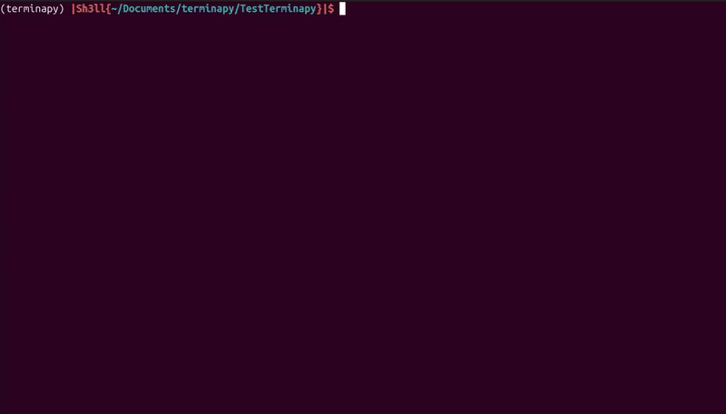

# Terminapy

**Terminapy** is a lightweight Python library for creating a simple ASCII/Unicode-based terminal "screen" with sub-screens. It allows you to divide the terminal into multiple panels, each managed independently, and safely share screens between threads.

## Demo


## What Is It For?

Terminapy provides multiple `Screen` classes that help you create and manage a terminal display:

    ╭───────────────────────┬───────────────────────╮
    │                       │                       │
    │                       │                       │
    │      Sub-Screen 1     │     Sub-Screen 2      │
    │   (displaying text)   │  (displaying text 2)  │
    │                       │                       │
    │                       │                       │
    ╰───────────────────────┴───────────────────────╯

> The lib provides functions to print the screen directly to the terminal, but you can also get the screen as a string and display it on your own. There will be some examples below.

### External libraries used:
> In this lib I will try to use as few external libraries as possible.
- os
- math
- time
- threading


## Installation

    pip install terminapy


## Description

This lib is based on the concept of screen / split screen. For example:

```
    ╭───────────────────────┬───────────────────────╮
    │                       │                       │
    │                       │                       │
    │      Sub-Screen 1     │     Sub-Screen 2      │
    │   (displaying text)   │  (displaying text 2)  │
    │                       │                       │
    │                       │                       │
    ╰───────────────────────┴───────────────────────╯

The architecture is like this:
Screen :
    -   Sub-Screen 1
    -   Sub-Screen 2
```

And if you want to have:
```
    ╭───────────────────────┬───────────────────────╮
    │   Sub-Sub-Screen 1    │                       │
    │                       │                       │
    ├───────────────────────┤     Sub-Screen 2      │
    │                       │  (displaying text 2)  │
    │   Sub-Sub-Screen 2    │                       │
    │                       │                       │
    ╰───────────────────────┴───────────────────────╯

The architecture is going to be like this:
Screen :
    -   Sub-Screen 1
        - Sub-Sub Screen 1
        - Sub-Sub Screen 2
    -   Sub-Screen 2
```

Each screen is specialized in a specific type (see section *Different Classes*).

Furthermore, this lib includes a class named **ScreenManager**. Its primary use is to simplify the user experience with useful features like:
- Automatic resize
- Autonomous display

> *see example for usage*


## Different Classes

### Screen

#### Use:
> A basic screen that cannot be used to display anything directly, but is used to contain other screens.

#### Functions:
| Method | Description |
| :------ | :---------- |
| `set_border_style(style: border.BorderStyle)` | Used to change the style of the border |
| `split_horizontally(ratio: float, screen_top, screen_bottom)` | Splits the screen horizontally with the specified ratio and takes two other screens, one for the top and one for the bottom. If set to None, it will take a copy of the current screen |
| `split_vertically(ratio: float, screen_left, screen_right)` | Splits the screen vertically with the specified ratio and takes two other screens, one for the left and one for the right. If set to None, it will take a copy of the current screen |
| `change_size(size: terminal_size)` | Used to change the size of the screen |
| `get_screen(left: bool)` | Returns the left sub-screen if left is True, otherwise returns the right sub-screen |
| `get_string_screen()` | Gets the current screen as a string. *Should only be used on the root screen* |
| `need_refresh(size: terminal_size)` | Returns True if the screen needs to be refreshed |
| `refresh(size: terminal_size)` | Refreshes the screen |

---

### Text

#### Use:
> A Text screen used to display any type of string, like a terminal. *(For now, **\n** should not be used in text given to this screen -- this will be fixed.)*

#### Functions:
| Method | Description |
| :------ | :---------- |
| `clear()` | Clears the screen |
| `append(message: str)` | Adds a message to the bottom of the screen |
| `change_lines(lines: list[str], copy: bool)` | Replaces all the lines of the screen. You can choose whether the list is copied or not |
| `rewrite_last_line(message: str)` | Replaces the last line |

---

### Graph

#### Use:
> A Graph screen with two types for now: Bar and Scatter. The screen takes one of the two graph types.

#### Screen Graph Functions:
| Method | Description |
| :------ | :---------- |
| `set_graph(graph: Graph)` | Sets the graph |
| `add_data(*args, **kwargs)` | Adds data to the dataset |
| `overwrite_data(*args, **kwargs)` | Overwrites the entire dataset with new values |
| `clear()` | Clears the dataset |
| `get_data()` | Returns the data |

#### Graph Types

#### Bar
> Basic bar chart\
> data = dict[ str, float ]

#### Bar Graph Functions:
| Method | Description |
| :------ | :---------- |
| `add_data(name: str, value: float)` | Column name and value to add to the column |
| `overwrite_data(name: str, value: float)` | Column name and value to overwrite in the column |
| `clear()` | Clears all data but not the columns |

#### Scatter
> Basic scatter plot\
> data = list[ tuple[ float, float ] ]

#### Scatter Graph Functions:
| Method | Description |
| :------ | :---------- |
| `add_data(x: float, y: float)` | Coordinates on the map |
| `add_multiple(data: list[tuple[float, float]])` | Adds multiple points to the map at the same time |
| `clear()` | Clears all data |

---

## Usage Examples

### Simple loop

```python
from terminapy.screenManager import ScreenManager

screen = ScreenManager()
while True:
    screen.draw_screen_on_terminal()
```

### Split vertically

```python
from terminapy.screenManager import ScreenManager
from terminapy.screenType.screenTypeEnum import ScreenTypeEnum

screen = ScreenManager()
screen.split_vertically(left=ScreenTypeEnum.TEXT, right=ScreenTypeEnum.TEXT)
while True:
    screen.draw_screen_on_terminal()
```

### Updating content

```python
from terminapy.screenManager import ScreenManager as ScM
from terminapy.screenType import ScreenTypeEnum as StE
import terminapy.screenType as tpe
import time
import random

l = ["A","B","C","D","E",'F']

screen : ScM = ScM()
graph_screen, text_screen = screen.split_vertically(ratio=0.5, left=StE.GRAPH, right=StE.TEXT)
graph_screen.set_graph(tpe.Bar(l[:]))
screen.full_autonome()

while True:
    graph_screen.add_data(random.choice(l), 1)
    text_screen.append(str(graph_screen.get_data()))
    time.sleep(0.1)
```

## API Recap

| Method | Description |
| :------ | :---------- |
| `Screen.set_border_style(style: border.BorderStyle)` | Used to change the style of the border |
| `Screen.split_horizontally(ratio: float, screen_top, screen_bottom)` | Splits the screen horizontally with the specified ratio. Takes two screens, one for the top and one for the bottom. If set to None, takes a copy of the current screen |
| `Screen.split_vertically(ratio: float, screen_left, screen_right)` | Splits the screen vertically with the specified ratio. Takes two screens, one for the left and one for the right. If set to None, takes a copy of the current screen |
| `Screen.change_size(size: terminal_size)` | Used to change the size of the screen |
| `Screen.get_screen(left: bool)` | Returns the left sub-screen if left is True, otherwise returns the right sub-screen |
| `Screen.get_string_screen()` | Gets the current screen as a string. *Should only be used on the root screen* |
| `Screen.need_refresh(size: terminal_size)` | Returns True if the screen needs to be refreshed |
| `Screen.refresh(size: terminal_size)` | Refreshes the screen |
| `Text.clear()` | Clears the screen |
| `Text.append(message: str)` | Adds a message to the bottom of the screen |
| `Text.change_lines(lines: list[str], copy: bool)` | Replaces all the lines of the screen. You can choose whether the list is copied or not |
| `Text.rewrite_last_line(message: str)` | Replaces the last line |
